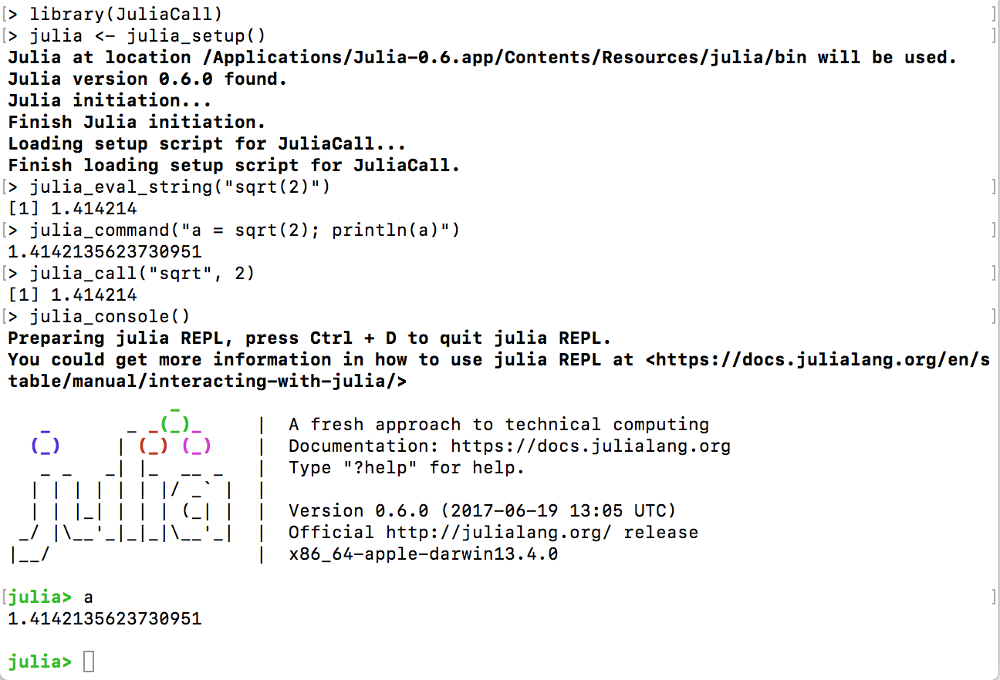

<!-- README.md is generated from README.Rmd. Please edit that file -->
JuliaCall for Seamless Integration of R and Julia
=================================================

[](https://travis-ci.org/Non-Contradiction/JuliaCall) [](https://ci.appveyor.com/project/Non-Contradiction/JuliaCall) [](https://cran.r-project.org/package=JuliaCall)

Package JuliaCall is an R interface to 'Julia', which is a high-level, high-performance dynamic programming language for numerical computing, see <https://julialang.org/> for more information.



Installation
------------

`JuliaCall` is on CRAN now! To use package `JuliaCall`, you first have to install `Julia` <https://julialang.org/> on your computer, and then you can install `JuliaCall` just like any other R packages by

``` r
install.packages("JuliaCall")
```

You can get the development version of `JuliaCall` by

``` r
devtools::install_github("Non-Contradiction/JuliaCall")
```

Basic Usage
-----------

``` r
library(JuliaCall)

## Do initial setup

julia <- julia_setup()
#> Julia at location /Applications/Julia-0.6.app/Contents/Resources/julia/bin will be used.
#> Julia version 0.6.0 found.
#> Julia initiation...
#> Finish Julia initiation.
#> Loading setup script for JuliaCall...
#> Finish loading setup script for JuliaCall.

## Different ways for using Julia to calculate sqrt(2)

# julia$command("a = sqrt(2)"); julia$eval_string("a")
julia_command("a = sqrt(2)"); julia_eval_string("a")
#> [1] 1.414214
julia_eval_string("sqrt(2)")
#> [1] 1.414214
julia_call("sqrt", 2)
#> [1] 1.414214
julia_eval_string("sqrt")(2)
#> [1] 1.414214
julia_assign("x", sqrt(2)); julia_eval_string("x")
#> [1] 1.414214
julia_assign("rsqrt", sqrt); julia_call("rsqrt", 2)
#> [1] 1.414214
2 %>J% sqrt
#> [1] 1.414214

## You can use `julia$exists` as `exists` in R to test
## whether a function or name exists in Julia or not

julia_exists("sqrt")
#> [1] TRUE
julia_exists("c")
#> [1] FALSE

## You can use `julia$help` to get help for Julia functions

julia_help("sqrt")
#> ```
#> sqrt(x)
#> ```
#> 
#> Return $\sqrt{x}$. Throws [`DomainError`](@ref) for negative [`Real`](@ref) arguments. Use complex negative arguments instead. The prefix operator `√` is equivalent to `sqrt`.

## Functions related to installing and using Julia packages

julia_install_package("Optim")
julia_install_package_if_needed("Optim")
julia_installed_package("Optim")
#> [1] "0.9.3"
julia_library("Optim")
```

How to Get Help?
----------------

-   One way to get help for julia functions is just using `julia$help` like the following example:

``` r
julia_help("sqrt")
#> ```
#> sqrt(x)
#> ```
#> 
#> Return $\sqrt{x}$. Throws [`DomainError`](@ref) for negative [`Real`](@ref) arguments. Use complex negative arguments instead. The prefix operator `√` is equivalent to `sqrt`.
```

-   The GitHub Pages for this repository host the documentation for the development version of `JuliaCall`: <https://non-contradiction.github.io/JuliaCall/>.

-   And you are more than welcome to contact me about `JuliaCall` at <lch34677@gmail.com> or <cxl508@psu.edu>.

JuliaCall for R Package Developers
----------------------------------

If you are interested in developing an R package which is an interface for a Julia package, `JuliaCall` is an ideal choice for that!

Basically you only need to find the Julia function or Julia module you want to have in `R` and then just `using` the module and `call` the function. An example is `ipoptjlr`, which can be found at <https://github.com/Non-Contradiction/ipoptjlr>.

If you have any issues in developing an `R` package using `JuliaCall`, you may report it using the link: <https://github.com/Non-Contradiction/JuliaCall/issues/new>. Or email me at <lch34677@gmail.com> or <cxl508@psu.edu>.

Suggestion and Issue Reporting
------------------------------

`JuliaCall` is under active development now. Any suggestion or issue reporting is welcome! You may report it using the link: <https://github.com/Non-Contradiction/JuliaCall/issues/new>. Or email me at <lch34677@gmail.com> or <cxl508@psu.edu>.

And if you encounter some issues which crash `R` or `RStudio`, then you may have met segfault errors. I am very sorry. And I am trying my best to remove errors like that. It will be much appreciated if you can

-   download the source of `JuliaCall` from Github,
-   open `JuliaCall.Rproj` in your RStudio or open `R` from the directory where you download the source of `JuliaCall`,
-   run `devtools::check()` to see the result of `R CMD check` for `JuliaCall` on your machine,
-   and paste the result to the issue report.
